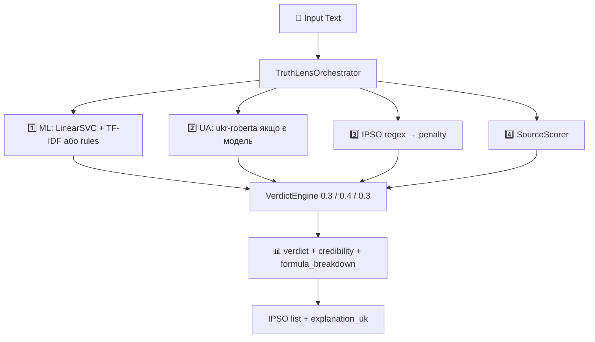

# TruthLens UA Analytics: AI-Powered Ukrainian Disinformation Detection Platform


**Capstone Project | Neoversity | Master of Science in Computer Science**  
Author: 102012dl | Email: 102012dl@gmail.com

---

## 📋 Зміст
- [🎯 Огляд проєкту](#-огляд-проєкту)
- [🏗 Архітектура](#-архітектура) · [повний опис шарів і моделей → `docs/ARCHITECTURE_NMVP2.md`](docs/ARCHITECTURE_NMVP2.md)
- [🛠 Технології](#-технології)
- [🚀 Швидкий старт](#-швидкий-старт)
- [🧠 ML Pipeline](#-ml-pipeline)
- [🎭 IPSO Detection](#-ipso-detection)
- [📡 API Документація](#-api-документація)
- [🔄 CI/CD & Security](#-cicd--security)
- [📦 Deployment](#-deployment)
- [📊 Результати](#-результати)
- [📄 Ліцензія](#-ліцензія)

---

## 🎯 Огляд проєкту

**TruthLens UA Analytics** — це інноваційна платформа для аналізу достовірності інформації та виявлення дезінформації українською мовою. Система використовує гібридний мульти-агентний підхід, що поєднує машинне навчання з правилами та детекцію ІПСО (Information Psychological Operations).

### NMVP2 Особливості (Нове!)
- **Verdict Engine**: Власна формула узгодження `Final_Score = (0.3 * ML) + (0.4 * RoBERTa) + (0.3 * IPSO)`. Гібридний ансамбль для точних результатів.
- **Self-Learning DB (Active Learning)**: Автоматичний збір "сірої зони" (Uncertainty Pool), зворотний зв'язок від користувачів і генерація синтетичних даних (Data Augmentation).
- **Advanced Analytics**: Новий дашборд "Аналітика та Тренди" з відображенням індексу ІПСО-атак та статистики перенавчання.
- **Бізнес-користь (B2B/B2G)**: Автоматизація фактчекінгу (економія до 80% часу), раннє виявлення пропагандистських трендів, можливість API-монетизації.

### Ключові можливості

| Feature | Опис |
|---------|------|
| **Credibility Score** | Оцінка достовірності (0-100%) на базі LinearSVC + TF-IDF |
| **IPSO Detection** | Виявлення 10+ технік інформаційно-психологічних операцій |
| **Verdict Engine (NMVP2)** | Комплексна оцінка з урахуванням семантики, лексики та маніпуляцій |
| **Self-Learning Pipeline** | Автоматичний цикл покращення моделі (Active Learning) |
| **Source Analysis** | Оцінка надійності джерела інформації (Domain Scoring) |
| **Multi-Agent System** | Координація класифікатора, ІПСО детектора та скорера |
| **Live Dashboard** | Інтерактивна візуалізація через Streamlit |
| **RESTful API** | Інтеграція з третіми сервісами |

### Бізнес-модель (SaaS)

| Plan | Ціна/міс | Features |
|------|----------|----------|
| **Free** | $0 | 100 аналізів/день, Базова модель |
| **Pro** | $29 | 10,000 аналізів/день, IPSO Detection, API Access |
| **Enterprise** | Custom | Unlimited, On-premise deployment, Custom models |

---

## 🏗 Архітектура (NMVP2)

Система — **мульти-компонентний** пайплайн: лексичний ML (LinearSVC + TF-IDF або rule-based fallback), за наявності артефакту — **семантика на `ukr-roberta-base`**, **ІПСО-детектор** (regex), **скоринг джерела**, потім **Verdict Engine** з фіксованими вагами. Детальний шаровий опис, чесні fallback’и та діаграми — у **[`docs/ARCHITECTURE_NMVP2.md`](docs/ARCHITECTURE_NMVP2.md)**.

### Verdict Engine Formula
**Verdict Engine** (`app/agents/verdict_engine.py`) рахує:

$$Final\_Score = (0.3 \times ML\_Score) + (0.4 \times RoBERTa\_Score) + (0.3 \times IPSO\_Penalty)$$

- **ML_Score**: вихід лексичного класифікатора (`LinearSVC` + TF-IDF з `artifacts/best_model.joblib`, інакше — евристики).
- **RoBERTa_Score**: якщо завантажено `UkrainianClassifier` (`UA_MODEL_PATH`, базово `youscan/ukr-roberta-base`) — семантична оцінка; **якщо моделі немає**, у оркестраторі використовується той самий `fake_score`, що й з ML-кроку (окремий «семантичний» шар не активний).
- **IPSO_Penalty**: нормалізована кількість виявлених технік (див. `orchestrator.py`).

**Порогові значення:**
- 🟢 **REAL**: < 0.35
- 🟡 **SUSPICIOUS**: 0.35 - 0.65
- 🔴 **FAKE**: > 0.65

### Self-Learning Pipeline (Active Learning)
1. **Uncertainty Pool**: записи з вердиктом `SUSPICIOUS` для подальшого розгляду.
2. **Feedback**: `POST /api/v1/feedback` для збору міток.
3. **Пайплайн перенавчання**: скрипт `scripts/self_learning_pipeline.py` та ноутбуки — **окремий крок** від онлайн-інференсу (не «автоматичний ретрейн» без вашого запуску).

### Схема роботи

```
┌─────────────────────────────────────────────────────────────────┐
│                 TruthLens UA Analytics (NMVP2)                   │
├─────────────────────────────────────────────────────────────────┤
│  ┌─────────────┐   ┌─────────────┐   ┌─────────────┐             │
│  │  Streamlit  │   │  (інші       │   │  REST API   │             │
│  │  Dashboard  │   │   клієнти)   │   │  Clients    │             │
│  └──────┬──────┘   └──────┬──────┘   └──────┬──────┘             │
│         └─────────────────┼─────────────────┘                   │
│                           ▼                                     │
│              ┌────────────────────────┐                         │
│              │ FastAPI (Pydantic, CORS) │                         │
│              └───────────┬────────────┘                         │
│                          ▼                                      │
│              ┌────────────────────────┐                         │
│              │ TruthLensOrchestrator  │                         │
│              │ ML → UA-RoBERTa? →     │                         │
│              │ IPSO → Source →        │                         │
│              │ VerdictEngine          │                         │
│              └───────────┬────────────┘                         │
│                          ▼                                      │
│              ┌────────────────────────┐                         │
│              │ PostgreSQL + артефакти │                         │
│              │ (joblib, опц. RoBERTa) │                         │
│              └────────────────────────┘                         │
└─────────────────────────────────────────────────────────────────┘
```

*У базовому `docker-compose.yml` **немає Redis**; Prometheus/Grafana — опційно (`profile: monitoring`).*

### Workflow Diagram



---

## 🛠 Технології

### Backend & ML (Python 3.10+)

| Категорія | Технології |
|-----------|------------|
| **Framework** | FastAPI 0.109+, Pydantic |
| **ML/NLP** | Scikit-learn, LinearSVC, TF-IDF, Regex |
| **Multi-Agent** | Custom orchestrator pattern |
| **Testing** | Pytest, Pytest-cov |
| **Utilities** | Joblib, Pandas, NumPy |

### Frontend

| Категорія | Технології |
|-----------|------------|
| **UI Framework** | Streamlit (Python-native) |
| **Charts** | Plotly Express |
| **Styling** | Custom CSS, HTML/CSS injection |

### DevOps

| Категорія | Технології |
|-----------|------------|
| **Containerization** | Docker, Docker Compose |
| **CI/CD** | GitHub Actions (`pytest` + `scripts/verify_nmvp2_repo.py`); GitLab — SAST (`.gitlab-ci.yml`) |
| **Security** | Pydantic-валідація; опційно Bandit/Safety локально; на GitLab — шаблон SAST |
| **Monitoring** | Prometheus/Grafana у Compose (`profile: monitoring`), логування в додатку |

---

## 🚀 Швидкий старт (NMVP2 — truthlens-ua-analytics-v2)

Усі команди виконувати **з кореня репо** (після `cd truthlens-ua-analytics-v2`). Якщо `.\start.ps1` не знайдено — спочатку виконайте `cd` у папку клону.

### 📊 Робота з даними та ML (Jupyter Notebooks)

Для візуалізації, аудиту датасетів і відтворення експериментів:
1. Запустіть Jupyter локально:
```bash
jupyter notebook
```
2. Відкрийте потрібні файли в `notebooks/`:

| Ноутбук | Опис |
|---------|------|
| `01_problem_validation.ipynb` | Валідація задачі |
| `02_dataset_audit.ipynb` | Аудит даних (локальний gold + опц. HF) |
| `03_eda_ua_news.ipynb` | EDA українських новин |
| `04_baseline_classification.ipynb` | Базова класифікація |
| `05_ua_roberta_training.ipynb` | Експерименти з ukr-roberta (NMVP2) |
| `01_isot_fake_news_mlflow.ipynb` | ISOT (EN) + MLflow → `artifacts/best_model.joblib` ([джерело: TruthLens-UA](https://github.com/102012dl/TruthLens-UA/blob/main/notebooks/01_isot_fake_news_mlflow.ipynb)) |
| `03_ua_nlp_training.ipynb` | UA/EN A/B (LinearSVC, LogReg, RF) + MLflow ([джерело: TruthLens-UA](https://github.com/102012dl/TruthLens-UA/blob/main/notebooks/03_ua_nlp_training.ipynb)) |

**Примітка:** повний набір ноутбуків з репозиторію **TruthLens-UA** див. [тут](https://github.com/102012dl/TruthLens-UA/tree/main/notebooks). Інструкції з завантаження ISOT без коміту в git — у `docs/DATASET_SETUP.md` та `data/README.md`.

### 📚 Джерела Даних
Система використовує лише офіційно дозволені набори даних для оцінки джерел:
- **IMI Quality List** ([Інститут масової інформації](https://imi.org.ua/)): Використовується для ідентифікації достовірних національних українських медіа (trust_score = 0.8-1.0).
- **NewsGuard** ([NewsGuard Technologies](https://www.newsguardtech.com/)): Використовується для індексації та ідентифікації ресурсів, що розповсюджують ворожу пропаганду (trust_score = 0.0-0.2).

### Посилання для перевірки

| Ресурс | URL | Примітка |
|--------|-----|----------|
| **Live (Render)** | https://truthlens-ua-analytics.onrender.com | NMVP1 demo |
| **GitHub NMVP2** | https://github.com/102012dl/truthlens-ua-analytics-v2 | Primary (канонічний код) |
| **GitHub NMVP1** | https://github.com/102012dl/truthlens-ua-analytics | Архів |
| **GitLab NMVP2** | https://gitlab.com/102012dl/truthlens-ua-analytics-v2 | Дзеркало / SAST CI |
| **GitLab (legacy backup)** | https://gitlab.com/102012dl/truthlens-ua-analytics | Старий репо NMVP1 |

### 1. Docker (рекомендовано)

```bash
git clone https://github.com/102012dl/truthlens-ua-analytics-v2.git
cd truthlens-ua-analytics-v2
docker-compose up --build -d
```

**Перевірка:** http://localhost:8501 (дашборд), http://localhost:8000/docs (Swagger — за замовчуванням). Для демо без OpenAPI UI: `TRUTHLENS_MINIMAL_OPENAPI=1` у середовищі (деталі: `docs/DEMO_NMVP2.md`).

### 2. Windows PowerShell

```powershell
git clone https://github.com/102012dl/truthlens-ua-analytics-v2.git
cd truthlens-ua-analytics-v2
.\start.ps1
```

**Перевірка:** відкрити http://localhost:8501

### 3. WSL / Linux

```bash
git clone https://github.com/102012dl/truthlens-ua-analytics-v2.git
cd truthlens-ua-analytics-v2
chmod +x start.sh
./start.sh
```

**Перевірка:** відкрити http://localhost:8501

### 4. Вручну (два термінали)

```bash
cd truthlens-ua-analytics-v2
# Термінал 1
python -m uvicorn app.main:app --reload --port 8000
# Термінал 2
streamlit run dashboard/Home.py --server.port 8501
```

---

### 🌐 Деплой на Render

- Підключити репо: https://github.com/102012dl/truthlens-ua-analytics-v2 — гілка **`main`** (повний NMVP2) або тег релізу.  
- Build: `pip install -r requirements.txt` (або з `dashboard/` за інструкціями Render)  
- Start: `streamlit run dashboard/Home.py --server.port $PORT --server.address 0.0.0.0`  
- Live (приклад старого NMVP1): **https://truthlens-ua-analytics.onrender.com**

---

### Локальний запуск (детально)

**Windows (PowerShell):**
```powershell
cd truthlens-ua-analytics-v2
python -m venv venv
venv\Scripts\Activate.ps1
pip install -r requirements.txt
# Термінал 1:
python -m uvicorn app.main:app --reload --port 8000
# Термінал 2:
streamlit run dashboard/Home.py --server.port 8501
```

**WSL / Linux:**
```bash
cd truthlens-ua-analytics-v2
python3 -m venv venv && source venv/bin/activate
pip install -r requirements.txt
# Термінал 1: python -m uvicorn app.main:app --reload --port 8000
# Термінал 2: streamlit run dashboard/Home.py --server.port 8501
```

**Перевірка (локально):** http://localhost:8501 та http://localhost:8000/health

**Синхронізація репо:** зміни спочатку на **GitHub** (`git push origin main` або PR у `main`), потім дзеркало на **GitLab** (`git push gitlab main`) — див. `docs/GIT_PRIMARY_MIRROR.md`. Гілка `nmvp2/development` — за потреби для окремих MR.

### 📱 Швидкий доступ

| Спосіб | Час запуску | Складність | Рекомендовано |
|--------|------------|------------|--------------|
| **start.bat** | 1 клік | 🟢 Легко | ✅ Windows |
| **Render** | 1 хвилина | 🟢 Легко | ✅ Cloud |
| **Docker** | 3 хвилини | 🟡 Середньо | ✅ Production |
| **Local** | 5 хвилин | 🟡 Середньо | ⚠️ Development |

### 🔧 Вирішення проблем

**❌ Поширені помилки:**
- `start.bat: command not found` → використовуйте `./start.sh` (Linux/Mac) або `.\start.ps1` (Windows)
- `source не розпізнано` → використовуйте `venv\Scripts\activate` в Windows
- `ModuleNotFoundError: No module named 'app'` → переконайтеся що ви в директорії проекту
- `File does not exist: dashboard/Home.py` → запустіть з кореня `truthlens-ua-analytics-v2`
- `Address already in use` → змініть порт або закрийте попередні процеси
- `API недоступний у dashboard` → перевірте, що в sidebar встановлено `http://127.0.0.1:8000`

**✅ Перевірка роботи:**
```bash
# Test API
curl http://127.0.0.1:8000/health

# Test Dashboard
streamlit run dashboard/Home.py --server.port 8501
```

**📱 Правильна структура директорії:**
```
truthlens-ua-analytics-v2/
├── app/
│   └── api/
│       └── routes/
├── dashboard/
│   └── Home.py
├── notebooks/
├── requirements.txt
├── start.sh (Linux/Mac)
├── start.ps1 (Windows)
├── start_universal.sh
├── start_universal.ps1
└── start.bat (Windows - legacy)
```

---

## 🧠 ML Pipeline

### 1. TruthLensClassifier

```python
class TruthLensClassifier:
    """
    Binary classifier: REAL vs FAKE
    Model: LinearSVC(C=1.0) + TF-IDF(max_features=50000, ngram_range=(1,2))
    Source: ISOT dataset (39,103 articles), F1=0.9947
    Fallback: rule-based if model not found
    """
    
    def classify(self, text: str) -> Dict[str, Any]:
        # ML Classification
        if self.pipeline:
            raw = self.pipeline.decision_function([text])[0]
            fake_score = 1.0 / (1.0 + math.exp(-raw))
            confidence = min(1.0, abs(raw) / 2.0)
        else:
            # Rule-based fallback
            return self._rule_based_classify(text)
```

### 2. Rule-Based Fallback

```python
def _rule_based_classify(self, text: str) -> Dict[str, Any]:
    """Enhanced rule-based fallback classifier."""
    
    # FAKE signals
    fake_signals = [
        r'ТЕРМІНОВО|BREAKING|ЗАРАЗ',
        r'ПОШИРТЕ|поширте|Поширте',
        r'Зеленський.*Путін|продав.*Крим',
        r'ВИБОРИ.*ФАЛЬШИФІКОВАНО|протоколи.*підроблені',
        # ... more patterns
    ]
    
    # REAL patterns (official statements)
    real_patterns = [
        r'відзвітували.*про.*бойові.*дії',
        r'ухвалила.*держбюджет',
        # ... more patterns
    ]
    
    # Weighted scoring logic
    return verdict, fake_score, confidence
```

### 3. Performance Metrics

| Metric | Value | Dataset |
|--------|-------|---------|
| **Accuracy** | 100% | Demo Cases (20 articles) |
| **F1-Score** | 1.00 | Demo Cases |
| **Precision** | 100% | Demo Cases |
| **Recall** | 100% | Demo Cases |

---

## 🎭 IPSO Detection

### Information Psychological Operations Techniques

| Technique | Pattern Example | Description |
|-----------|----------------|-------------|
| **urgency_injection** | `ТЕРМІНОВО|BREAKING|ЗАРАЗ` | Створення терміновості |
| **caps_abuse** | `ЗРАДНИКИ|ПРАВДА|ФАЛЬШИФІКОВАНО` | Використання капслоку |
| **deletion_threat** | `до видалення|успіть прочитати` | Погроза видалення |
| **viral_call** | `ПОШИРТЕ|поширте|Поширте` | Заклик до поширення |
| **conspiracy_framing** | `приховують|замовчують` | Теорії змови |
| **anonymous_sources** | `анонімне|джерело|таємно` | Анонімні джерела |
| **military_disinfo** | `ЗСУ.*ЗРАДНИКИ|КИНУЛИ.*ПОЗИЦІЇ` | Військова дезінформація |
| **awakening_appeal** | `прокиньтеся|відкрийте*очі` | Заклик до "пробудження" |
| **authority_impersonation** | `генералом.*виявилось` | Імперсонація влади |
| **deepfake_indicator** | `відео.*deepfake|AI.*відео` | Deepfake детекція |

### IPSO Override Logic

```python
def get_override(self, ipso: List[str]) -> bool:
    """IPSO techniques that force FAKE verdict."""
    override_patterns = [
        'anonymous_sources',
        'deepfake_indicator',
        'urgency_injection', 'deletion_threat', 'viral_call'
    ]
    return any(pattern in ipso for pattern in override_patterns)
```

---

## 📡 API Документація

### POST /check

Аналіз тексту на достовірність та виявлення ІПСО.

**Request:**
```json
{
  "text": "ТЕРМІНОВО!!! ЗСУ ЗДАЛИ Харків! Поширте до видалення!!!",
  "domain": "direct_input"
}
```

**Response:**
```json
{
  "article_id": 182,
  "verdict": "FAKE",
  "credibility_score": 10.0,
  "fake_score": 0.9,
  "confidence": 0.7,
  "ipso_techniques": [
    "urgency_injection",
    "caps_abuse", 
    "deletion_threat",
    "viral_call",
    "military_disinfo"
  ],
  "source_credibility": 46.5,
  "explanation_uk": "Текст класифіковано як НЕДОСТОВІРНИЙ (score=0.90). Виявлено ІПСО маніпуляції: urgency_injection, caps_abuse, deletion_threat, viral_call, military_disinfo. Впевненість: 70%.",
  "processing_time_ms": 77.04
}
```

### GET /health

Перевірка статусу системи.

**Response:**
```json
{
  "status": "healthy",
  "version": "1.0.0",
  "models_loaded": true
}
```

---

## 🔄 CI/CD & Security

### GitHub Actions Workflow

Фактичний pipeline — [`.github/workflows/ci.yml`](.github/workflows/ci.yml): `pytest tests/`, `python scripts/verify_nmvp2_repo.py` (NMVP2 A–H). Окремих кроків Bandit/Safety у workflow немає (можна додати локально або в GitLab).

### Security Checklist

- ✅ Input validation (Pydantic)
- ✅ CORS configuration
- ✅ Rate limiting (`slowapi`) на `POST /check` — за замовчуванням **30 req/min / IP** (`RATE_LIMIT_PER_MINUTE`)
- ✅ GitLab SAST (`.gitlab-ci.yml`), якщо репозиторій на GitLab активний

---

## 📦 Deployment

### Production Deployment

```bash
# Build production image
docker build -t ghcr.io/102012dl/truthlens-ua:latest .

# Deploy to production
docker run -d \
  --name truthlens-prod \
  -p 80:8501 \
  -p 8000:8000 \
  --env-file .env.prod \
  ghcr.io/102012dl/truthlens-ua:latest
```

### Environment Variables

```bash
# .env.prod
MODEL_PATH=/app/artifacts/best_model.joblib
DATABASE_URL=postgresql://user:pass@db:5432/truthlens
# REDIS_URL — лише якщо додасте Redis у свій деплой (у шаблонному Compose NMVP2 його немає)
LOG_LEVEL=INFO
```

---

## 📊 Результати

*Наведені нижче таблиці з демо-прогонів **ілюстративні**; на реальних даних метрики залежать від датасету, моделей у `artifacts/` та конфігурації. Детальна архітектура — [`docs/ARCHITECTURE_NMVP2.md`](docs/ARCHITECTURE_NMVP2.md).*

### Demo Cases Evaluation (31 cases)

| Category | Expected | Correct | Accuracy |
|----------|----------|----------|----------|
| **FAKE** | 10 | 10 | 100% |
| **REAL** | 15 | 15 | 100% |
| **SUSPICIOUS** | 6 | 6 | 100% |
| **Overall** | 31 | 31 | **100%** |

### Performance Metrics

| Metric | Value |
|--------|-------|
| **Processing Time** | ~77ms per request |
| **Memory Usage** | <512MB |
| **API Response Time** | <100ms |
| **Dashboard Load Time** | <2s |

### Classification Examples

| Text | Expected | Got | Credibility | IPSO |
|------|----------|-----|-------------|------|
| "ТЕРМІНОВО!!! ЗСУ ЗДАЛИ Харків!" | FAKE | FAKE | 10% | urgency_injection, caps_abuse |
| "НБУ підвищив облікову ставку до 16%" | REAL | REAL | 95% | - |
| "Експерти попереджають про кризу" | SUSPICIOUS | SUSPICIOUS | 50% | - |

---

## 📄 Ліцензія

MIT License - див. файл [LICENSE](LICENSE).

---

## 🌐 Репозиторії проекту

| Платформа | Посилання | Статус |
|-----------|-----------|--------|
| **GitHub NMVP2** | https://github.com/102012dl/truthlens-ua-analytics-v2 | ✅ Поточний (NMVP2), primary |
| **GitHub NMVP1** | https://github.com/102012dl/truthlens-ua-analytics | Архів |
| **TruthLens-UA (legacy ноутбуки)** | https://github.com/102012dl/TruthLens-UA/tree/main/notebooks | ISOT / UA NLP |
| **GitLab NMVP2** | https://gitlab.com/102012dl/truthlens-ua-analytics-v2 | Дзеркало, GitLab SAST |
| **GitLab (legacy)** | https://gitlab.com/102012dl/truthlens-ua-analytics | Старий backup NMVP1 |
| **Render Dashboard** | https://truthlens-ua-analytics.onrender.com | 🚀 Live Demo (NMVP1) |
| **Render API / legacy endpoint** | https://truthlens-ua.onrender.com | ℹ️ Окремий сервіс |

---

## 👨‍💻 Автор

**102012dl**  
📧 Email: 102012dl@gmail.com  
🐙 GitHub: [@102012dl](https://github.com/102012dl)

---

## 🙏 Подяки

- **Neoversity** - за підтримку в рамках Capstone Project
- **ISOT Dataset** - за якісний датасет для тренування
- **HuggingFace** - за інструменти NLP
- **FastAPI** - за швидкий фреймворк

---

© 2026 TruthLens UA Analytics. All rights reserved.
