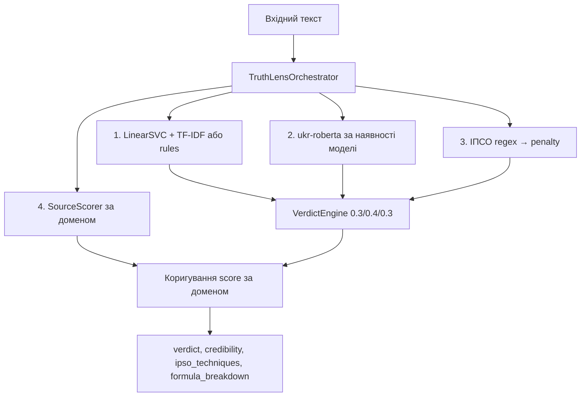

# Архітектура TruthLens UA Analytics — NMVP2

Канонічний опис відповідає коду в `app/agents/` (оркестратор, verdict engine, класифікатори). Оновлено для узгодження з репозиторієм [truthlens-ua-analytics-v2](https://github.com/102012dl/truthlens-ua-analytics-v2).

---

## 1. Ідея

Платформа оцінює **україномовний** (або змішаний) текст на ознаки **маніпуляцій і недостовірності**: поєднує **лексичний ML-класифікатор**, за наявності — **семантику на базі ukr-RoBERTa**, **детекцію ІПСО-технік** (правила/regex) і **скоринг джерела** за доменом. Фінальний вердикт дає **Verdict Engine** з фіксованими вагами та порогами.

---

## 2. Шари (зверху вниз)

| Шар | Реалізація | Роль |
|-----|------------|------|
| **Клієнти** | Streamlit `dashboard/`, HTTP-клієнти | Введення тексту / URL, відображення `verdict`, метрик, `formula_breakdown` |
| **API** | FastAPI `app/main.py`, `POST /check`, `POST /api/v1/feedback` | Валідація `CheckRequest`, Pydantic `CheckResponse`, CORS |
| **Оркестрація** | `TruthLensOrchestrator` (`app/agents/orchestrator.py`) | Послідовний виклик класифікатора → UA-моделі → ІПСО → скорер → Verdict Engine |
| **Моделі / правила** | Див. §3 | ML, семантика, ІПСО, домен |
| **Зберігання** | PostgreSQL (Alembic), Docker Compose `db` | Статті, клейми, чеки, UncertaintyPool, feedback |
| **Артефакти ML** | `artifacts/best_model.joblib`, `artifacts/ua_roberta_model/` (опційно) | Не в git за замовчуванням; шлях через `MODEL_PATH`, `UA_MODEL_PATH` |
| **Спостереження** | Prometheus/Grafana у `docker-compose` з **profile `monitoring`** | Не обов’язкові для базового запуску |

**Примітка:** у стандартному `docker-compose.yml` **немає Redis**; кеш/черги не є частиною поточного NMVP2-стеку.

---

## 3. Моделі та алгоритми

### 3.1 Лексичний класифікатор (`TruthLensClassifier`)

- **За замовчуванням:** `LinearSVC` + `TfidfVectorizer` (joblib з `MODEL_PATH`, типово `artifacts/best_model.joblib`).
- **Якщо файлу моделі немає:** евристичний **rule-based** класифікатор (патерни «фейкових» / «реалістичних» сигналів).
- Вихід: `fake_score`, `confidence`, `method`.

### 3.2 Семантика UA (`UkrainianClassifier`)

- Модель Hugging Face: базово **`youscan/ukr-roberta-base`**, завантаження з **`UA_MODEL_PATH`** (каталог зі збереженою fine-tune, напр. `artifacts/ua_roberta_model`).
- Якщо pipeline **не** завантажено (немає артефакту / `transformers`): оркестратор **не** змінює окремий «RoBERTa» шар — у формулі **`roberta_score` береться рівним `fake_score`** з ML-кроку (див. `orchestrator.py`).
- Для `language == "uk"` і наявної моделі — оцінка з `text-classification`, далі нормалізація в діапазон, узгоджений з вердиктом.

### 3.3 ІПСО (`IPSODetector`)

- Набір **regex/правил** для технік (urgency, viral_call, military_disinfo, …).
- **IPSO penalty** у оркестраторі: `min(len(techniques) / 4.0, 1.0)` (до 4 технік як «повна» маніпуляція).

### 3.4 Джерело (`SourceScorer`)

- Оцінка надійності домену (у т.ч. списки довіри / евристики); додатковий штраф для демонстраційних «чорних» доменів (див. код).

### 3.5 Verdict Engine (`VerdictEngine`)

Формула (код збігається з README):

$$\text{Final\_Score} = 0.3 \cdot ML + 0.4 \cdot RoBERTa + 0.3 \cdot IPSO\_penalty$$

- Пороги: **REAL** `< 0.35`, **SUSPICIOUS** `0.35–0.65`, **FAKE** `> 0.65`.
- Повертає `formula_breakdown` для API/дашборду.
- За наявності додаткового штрафу джерела — коригування `final_score` (див. orchestrator).

**Credibility (UI):** узгоджено з `(1 - final_score) * 100` у поточній реалізації.

---

## 4. Потік даних (спрощено)

```
Текст/URL → fetch тексту (check route) → Orchestrator.process(text, domain)
  → ML classify → [optional UA RoBERTa] → IPSO detect → source score
  → VerdictEngine.evaluate → пояснення UK → (опційно) запис у БД, UncertaintyPool
```

---

## 5. Діаграма платформи (ASCII)

```
┌─────────────────────────────────────────────────────────────────┐
│                 TruthLens UA Analytics (NMVP2)                   │
├─────────────────────────────────────────────────────────────────┤
│  ┌─────────────┐   ┌─────────────┐   ┌─────────────┐             │
│  │  Streamlit  │   │  (інші       │   │  REST API   │             │
│  │  Dashboard  │   │   клієнти)   │   │  Clients    │             │
│  └──────┬──────┘   └──────┬──────┘   └──────┬──────┘             │
│         └─────────────────┼─────────────────┘                   │
│                           ▼                                     │
│              ┌────────────────────────┐                         │
│              │ FastAPI (валідація,    │                         │
│              │  CORS, маршрути)       │                         │
│              └───────────┬────────────┘                         │
│                          ▼                                      │
│              ┌────────────────────────┐                         │
│              │ TruthLensOrchestrator  │                         │
│              │  Classifier │ IPSO │    │                         │
│              │  UA-RoBERTa│ Source   │                         │
│              │  → VerdictEngine       │                         │
│              └───────────┬────────────┘                         │
│                          ▼                                      │
│              ┌────────────────────────┐                         │
│              │ PostgreSQL + артефакти │                         │
│              │ (Alembic, joblib, опц.  │                         │
│              │  ukr-roberta в /app)   │                         │
│              └────────────────────────┘                         │
└─────────────────────────────────────────────────────────────────┘
```

---

## 6. Mermaid: логіка аналізу



---

## 7. Порівняння з маркетинговими блоками README

| Тема | Уточнення |
|------|-----------|
| «Завжди RoBERTa» | Семантика вмикається лише за наявності збереженої моделі та залежностей. |
| «Redis у стеку» | У базовому Compose — **немає**; не варто показувати як обов’язковий шар. |
| «100% точність / демо-кейси» | Таблиці в README — **ілюстративні**; офлайн-метрики — з ноутбуків і вашого протоколу оцінки. |
| CI «Bandit / Safety» | У `.github/workflows/ci.yml` зараз **pytest + verify**; SAST — окремо на GitLab. |

---

## 8. Пов’язані документи

- `docs/API_DASHBOARD_FIELD_AUDIT.md` — поля JSON ↔ Streamlit  
- `docs/DEMO_NMVP2.md` — демо без Swagger  
- `docs/DATASET_SETUP.md` — дані без коміту в git  
